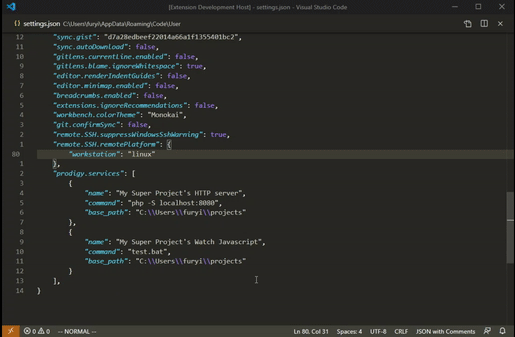

# VSCode Prodigy

## There is no need in this extension because of Custom Tasks mechanism in VSCode. I found it out after the extension was written. It was nice to get better understanding in Extension writting though.

The extension allows you to run/stop and see logs of external services. Pretty useful when you want to start a http server for your app or watch for JavaScript changes.

Basically the same as running those commands in terminal without the terminal.

## Features

* Run a service
* Stop a service
* Watch output of a service



## Extension Settings

This extension contributes the following settings:

* `prodigy.services`: list of services you have

The format is: 

```json
[
    {
        "name": "Name of the service",
        "command": "command you want to run",
        "base_path": "folder where command will be executed"
    },
    {
        "name": "Name of the service 2",
        "command": "command you want to run",
        "base_path": "folder where command will be executed"
    },
]
```

## Release Notes

### 0.0.4

* Fixed issue with `file://` scheme difference on windows and *nix
* use `tree-kill` package to kill a running service and its childs

### 0.0.3

Use SIGKILL instaed of SIGTERM when killing process

### 0.0.2

Add a logo for VSCode Marketplace

### 0.0.1

Initial release with basic functionality. Allows you to register commands and run/stop/log them.

**Enjoy!**
